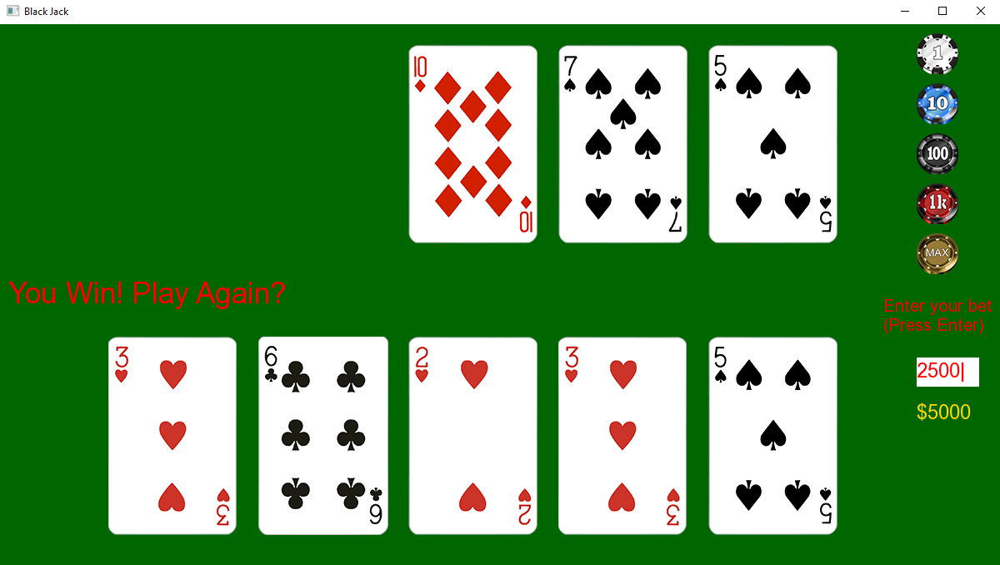

# Black Jack in C++ SFML

A simple black jack game using c++ sfml

- Press enter to ente the bet, and proceed the game
- Click the draw button if the player wants another card
- The dealer will stop drawing another card once the score hits 17
- the player will lose once the bet hits 0
- the player will win once the bet hits 10000
- the player can choose to player again by clicking the play again button

## Demo

The dealer drawing card logic is temporarily turned off for the purpose of demonstration

- In game
  
- Tie
  
- Win
  
- Lose
  
- Bet hits 10000
  
- Bet hits 0
  

## Design

Can be found in https://github.com/Serenity0204/Black_Jack_SFML/blob/master/design.txt

## Features

- Clickable buttons
- String to int parser
- Bet system
- Card Deck system

## System Setup

To run this project, please follow the system requirements below, this project has only been tested on windows.

`Windows: `

- compiler: g++ 13.1.0
- cmake: 3.20.0

`SFML setup: `

- windows: https://docs.google.com/document/d/13Tn2sq9-CtAMuUenALlj1l4f8xL-BzeI8-DKRjhdPu0/edit?usp=sharing
- mac: https://docs.google.com/document/d/1ujZWMMvwwIH_dAd-X4JvcVdtn7B71-joOjbOo-vVXLY/edit?usp=sharing
